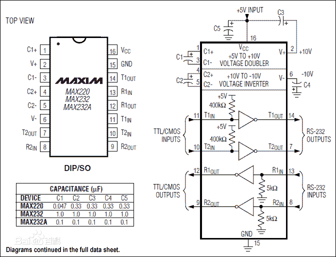

### 串口电平转换芯片 MAX3232

* 第一部分是电荷泵电路。由1、2、3、4、5、6脚和4只电容构成。功能是产生+12v和-12v两个电源，提供给RS-232串口电平的需要。
* 第二部分是数据转换通道。由7、8、9、10、11、12、13、14脚构成两个数据通道。
    * 第一数据通道: 13脚（R1IN）、12脚（R1OUT）、11脚（T1IN）、14脚（T1OUT）
    * 第二数据通道: 8脚（R2IN）、9脚（R2OUT）、10脚（T2IN）、7脚（T2OUT）为。
    * 原理说明：TTL/CMOS数据从11引脚（T1IN）、10引脚（T2IN）输入转换成RS-232数据从14脚（T1OUT）、7脚（T2OUT）送到电脑DB9插头；DB9插头的RS-232数据从13引脚（R1IN）、8引脚（R2IN）输入转换成TTL/CMOS数据后从12引脚（R1OUT）、9引脚（R2OUT）输出。
* 第三部分是供电。15脚GND、16脚VCC（+5v）。
