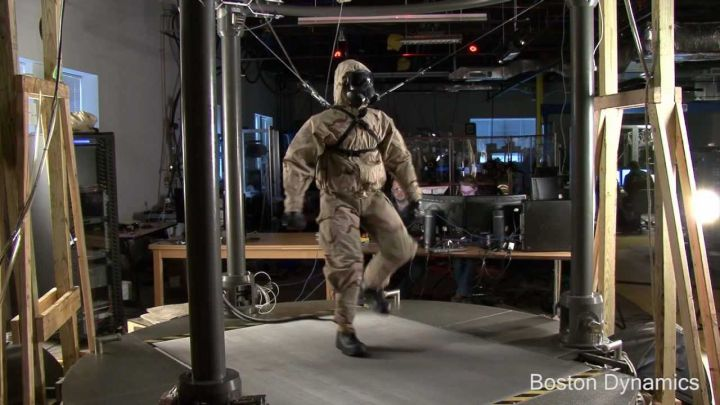

# 波士顿动力公司简介

## 马克·雷波特（Marc Raibert）

- 1949年出生，
- 1977年麻省理工获博士学位，
- 1980年创建 CMU leg实验室，主要从事研究与机器人相关的控制、机器视觉方面的技术。
- 1992年创建波士顿动力，起初是为美国陆军提供机器人研究制造的企业。
- 2013年波士顿动力被谷歌收购，2016年发布Atlas机器人
- 2017年波士顿动力被软银收购
### 机器人产品

- Petman: 测试化学防护服装的仿人机器人
    
- BigDog: 能够适应复杂地形条件的机器人
    
  - 其机载计算机能够控制躯体移动和过程传感器，处理通讯。控制系统保持躯体平衡，在不同的地形选择不同的运动和导航方式。
  - 该研究项目受美国国防高级研究计划局（DARPA）资金支持。
- LittleDog:
  
  - little Dog 是一款用来研究移动的四足机器人样机，研究人员用它来研究运动学，动态控制，环境感知和复杂地形移动之间的基本关系。

机动性！
人工智能控制系统负责让机器在任何情况下保持直立和平衡。实际上，告诉机器人该去哪里、该做什么是留给人类的事情，而人类则使用特制的平板电脑来控制Spot

中国Unitree Robotics公司设计的四足机器人Laikago

平衡和动态运动
移动操控
移动感知

[波士顿动力机器人背后的专利技术](https://zhuanlan.zhihu.com/p/62941774?from_voters_page=true)

[波士顿动力公司介绍-知乎](https://www.zhihu.com/question/48160959)